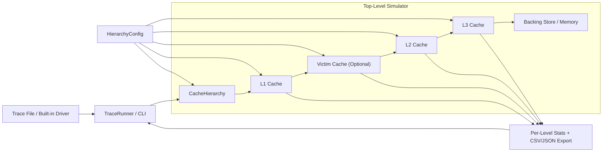

# Cache Simulator

A modular C++ cache simulator for experimenting with cache hierarchy behavior, replacement policies, write policies, and trace-driven workloads.

The project currently supports a three-level cache hierarchy (`L1`, `L2`, `L3`) with configurable hierarchy mode, trace replay, miss classification, and automated tests. It is structured as an extensible simulator rather than a one-file demo, so it can keep growing toward a more complete architecture study tool.

## Top-Level Architecture



At a high level:
- the CLI or trace runner drives accesses into the hierarchy
- `L1` is the primary fast cache
- the victim cache, when enabled, buffers recent `L1` evictions before they fall through to `L2`
- `L2` and `L3` provide deeper capacity
- the backing store services lines that miss in all cache levels

## What This Project Supports Today

### Cache hierarchy
- `L1`, `L2`, and `L3`
- Optional victim cache between `L1` and `L2`
- Backing memory model behind `L3`
- Inclusive hierarchy
- Exclusive hierarchy
- Non-inclusive, non-exclusive hierarchy

### Replacement policies
- `LRU`
- `FIFO`
- `Random`

### Write policy support

Supported hierarchy-wide policy pairs:
- `WriteBack + WriteAllocate`
- `WriteThrough + NoWriteAllocate`

The simulator currently enforces the same write policy and write-miss policy across `L1`, `L2`, and `L3`.

### Trace-driven execution
- Read operations: `R <address>`
- Write operations: `W <address> <value>`
- Hex or decimal numeric tokens
- Inline comments using `#`
- Validation for malformed lines, extra tokens, negative values, and 32-bit overflow

### Statistics
- Per-level read hits and misses
- Per-level write hits and misses
- Per-level writebacks
- Victim-cache stats when enabled
- `L1` compulsory misses
- `L1` capacity misses
- `L1` conflict misses
- CSV export
- JSON export

## Quick Start

### Build

```bash
make
```

This creates:
- `build/cache_sim`
- `build/cache_tests`
- `build/cache_fuzz`

### Run the built-in demo

```bash
./build/cache_sim
```

If you run the binary with no arguments, it executes a small built-in access sequence and prints per-level statistics plus the final cache contents.

### Run the test suite

```bash
make test
```

### Run the fuzz target

```bash
make fuzz
```

This runs a deterministic randomized workload across hierarchy modes, supported write-policy pairs, replacement policies, and optional victim-cache configurations. When it finds a failure, it reports the seed and recent access history so the case can be reproduced locally.

## Command-Line Usage

```bash
./build/cache_sim [trace_file] [inclusion_policy] [options...]
```

Arguments:
- `trace_file`
  Path to a trace file. If omitted, the built-in demo is used.
- `inclusion_policy`
  One of:
  - `inclusive`
  - `exclusive`
  - `non-inclusive`
- `write_policy`
  One of:
  - `write-back`
  - `writeback`
  - `wb`
  - `write-through`
  - `writethrough`
  - `wt`
- `victim_cache`
  One of:
  - `vc=off`
  - `vc=<entries>`
  - `vc=<entries>:lru`
  - `vc=<entries>:fifo`
  - `vc=<entries>:random`
- `export_format`
  One of:
  - `csv`
  - `json`

The optional arguments after `inclusion_policy` can be provided in any order.

### Example commands

```bash
./build/cache_sim traces/tiny/sample_trace.txt
./build/cache_sim traces/tiny/sample_trace.txt inclusive
./build/cache_sim traces/tiny/sample_trace.txt exclusive
./build/cache_sim traces/tiny/sample_trace.txt non-inclusive
./build/cache_sim traces/tiny/sample_trace.txt inclusive write-back
./build/cache_sim traces/tiny/sample_trace.txt inclusive write-through
./build/cache_sim traces/tiny/sample_trace.txt inclusive vc=2
./build/cache_sim traces/tiny/sample_trace.txt inclusive vc=4:fifo
./build/cache_sim traces/tiny/sample_trace.txt inclusive csv
./build/cache_sim traces/tiny/sample_trace.txt inclusive json
./build/cache_sim traces/tiny/sample_trace.txt inclusive write-through vc=2:lru json
```

## Trace Format

Each line is one memory operation.

### Read

```text
R <address>
```

Example:

```text
R 0x10
```

### Write

```text
W <address> <value>
```

Example:

```text
W 0x20 0x12345678
```

### Comments

Anything after `#` on a line is ignored.

Example:

```text
W 0x0 0x1   # initialize first word
R 0x0       # read it back
```

## Current Default Simulator Configuration

The command-line driver in [src/main.cpp](src/main.cpp) currently instantiates:

- Block size: `16` bytes
- `L1`: `64` bytes, `2`-way
- `L2`: `128` bytes, `2`-way
- `L3`: `256` bytes, `4`-way
- Replacement policy: `LRU`
- Victim cache: disabled by default

The CLI currently changes:
- hierarchy mode
- write mode
- victim-cache size and replacement policy
- export format

The cache sizes and replacement policy used by the main executable are still hardcoded in the driver for now.

## Sample Output

Running a trace prints each access result, followed by summary statistics.

Typical output shape:

```text
R 0x0 -> 0 (miss)
W 0x0 <- 1 (hit)

operations=2 loads=1 stores=1
L1 read_hits=0 read_misses=1 write_hits=1 write_misses=0 writebacks=0 compulsory_misses=1 capacity_misses=0 conflict_misses=0
VC read_hits=0 read_misses=0 write_hits=0 write_misses=0 writebacks=0
L2 read_hits=0 read_misses=1 write_hits=0 write_misses=0 writebacks=0
L3 read_hits=0 read_misses=1 write_hits=0 write_misses=0 writebacks=0
```

If `csv` or `json` is requested, that export is printed after the human-readable summary.
If the victim cache is disabled, the `VC` line is omitted.

## Included Trace Workloads

The repository includes three trace scales under [traces](traces):

- [traces/tiny](traces/tiny)
  Original small regression traces
- [traces/medium](traces/medium)
  1000-access variants
- [traces/long](traces/long)
  10000-access variants

A full index with pattern descriptions and exact access counts is available in [traces/README.md](traces/README.md).

Each size bucket includes the same behavior families:

- [sample_trace.txt](traces/tiny/sample_trace.txt)
- [scan_trace.txt](traces/tiny/scan_trace.txt)
- [thrashing_trace.txt](traces/tiny/thrashing_trace.txt)
- [recency_friendly_trace.txt](traces/tiny/recency_friendly_trace.txt)
- [streaming_trace.txt](traces/tiny/streaming_trace.txt)
- [mixed_access_pattern_trace.txt](traces/tiny/mixed_access_pattern_trace.txt)

These traces are meant to expose different cache behaviors such as scan-heavy access, reuse-friendly access, and conflict-heavy access.

## Miss Classification

The simulator currently classifies `L1` misses into:

- `Compulsory`
  First touch of a block.
- `Conflict`
  Misses in the real cache that would hit in a same-capacity fully associative `LRU` reference model.
- `Capacity`
  Misses in both the real cache and the same-capacity fully associative `LRU` reference model.

Important note:
- This classification is based on a same-capacity fully associative `LRU` shadow model.
- It is practical and useful, but it is not a full Mattson-stack analysis.

## Repository Layout

```text
include/cache_simulator/  Public headers
src/                      Executable and non-header-only implementation files
tests/                    Test suite
traces/                   Trace inputs and regression workloads
docs/                     Specification and project roadmap
build/                    Generated binaries from the Makefile
```

### Key files

- [include/cache_simulator/cache.hpp](include/cache_simulator/cache.hpp)
  Umbrella include for the main public types.
- [include/cache_simulator/l1_cache.hpp](include/cache_simulator/l1_cache.hpp)
  Core cache-level implementation.
- [include/cache_simulator/victim_cache.hpp](include/cache_simulator/victim_cache.hpp)
  Optional fully associative victim cache for recently evicted `L1` lines.
- [include/cache_simulator/cache_hierarchy.hpp](include/cache_simulator/cache_hierarchy.hpp)
  Three-level hierarchy controller.
- [include/cache_simulator/cache_set.hpp](include/cache_simulator/cache_set.hpp)
  Set-local lookup and replacement behavior.
- [include/cache_simulator/cache_stats.hpp](include/cache_simulator/cache_stats.hpp)
  Statistics container and CSV/JSON export helpers.
- [include/cache_simulator/trace_runner.hpp](include/cache_simulator/trace_runner.hpp)
  Trace parsing and replay.
- [docs/spec.md](docs/spec.md)
  Implementation roadmap and feature spec.

## Development Notes

### Why most logic is in headers

The main cache classes are templated on block size, so much of the implementation is intentionally header-only. That is why the public headers contain substantial logic.

### Build system

The project currently uses a small [Makefile](Makefile) and GitHub Actions CI:

- Build: `make`
- Test: `make test`
- Fuzz smoke: `make fuzz`

## Current Limitations

- The executable uses fixed cache sizes and `LRU` in `main.cpp`
- The executable uses fixed `L1/L2/L3` sizes in `main.cpp`
- Block size is compile-time fixed in the instantiated cache type
- Lower-level stats still include hierarchy-internal activity, so they are not yet cleanly separated into demand traffic vs internal refill/writeback traffic
- `L2` and `L3` currently reuse the same cache-level implementation rather than having fully separate level-specific classes
- Accesses are modeled as aligned 32-bit word accesses at the cache API level

## Roadmap

For the broader project direction, see [docs/spec.md](docs/spec.md).

Good next steps for the codebase are:
- separate demand stats from internal hierarchy traffic
- add CLI or config-file control for cache sizes and replacement policy
- add more advanced replacement policies such as `SRRIP`
- split tests into smaller component-focused files as the suite grows
